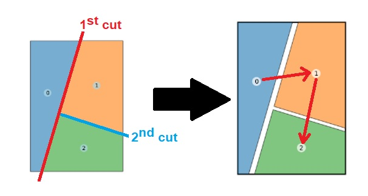

# ComfyUI Panels

This packages contains nodes for generating and-or organizing comics-manga like panels, such as the ones below (_images have the workflow embedded_).

## Panel Layouts

Panel Layouts are abstract hierarchical representations of a series of cuts made on a page to create comic or manga panels.

The process begins with an empty page (a single full-page panel). Initial cuts—whether single or multiple equally spaced ones—divide this page into distinct panels. Subsequent cuts are applied to existing panels and can be nested to achieve arbitrary levels of complexity.

Cuts are defined by:
- **Direction** — horizontal or vertical
- **Position** — selected from 5 potential relative positions to the panel being cut
- **Angle** — a slight deviation from the defined direction for aesthetic purposes
- **Number of cuts** — only applicable for one relative position option, where cuts are forced to have equal spacing

Sample layouts are provided in the [sample_layouts](sample_layouts) folder, but you can create and store your own using the **Save Panel Layout** node.

The image below shows one of the sample layouts:

A Panel Layout does **NOT** store specific panel properties such as:
- Corner shape
- Margins relative to page borders
- Line thickness or style

However, it can implicitly define relative spacing between panels through the order of cuts, though not with concrete values.

The order of panels (annotated with number stamps) is determined by the cut sequence. By default, this order also defines relative spacing between panels. The first cut(s) create larger margins, suggesting a reading direction parallel to the cut for nested panels, which are visually grouped due to having smaller margins. **The panel order aligns with this visual suggestion**—to deviate from this pattern, you must modify the panels or their order separately from the layout.

When saving, previewing, or processing a layout, you can choose between left-to-right or right-to-left orientations. These options don't change the underlying data—a layout saved as left-to-right can be used as right-to-left—but help maintain visual coherence with your preferred reading direction.

## Panels  

Panels are represented as `shapely.Polygon` objects, defining the concrete shape of each panel on the canvas.

To extract panels from a layout, use the **Build Layout Panels** node.

These panels can be modified using the following nodes:  
- **Rotate Polygon**  
- **Scale Polygon**  
- **Translate Polygon**  
- **Skew Polygon**
- **Bevel Polygon**  
- **Offset Polygon Bounds**

Alternatively, panels can be extracted from images using the **Detect Panels In Image** node. This node uses a basic computer vision algorithm that performs best on blank images with black shapes representing the panels. However, clean and simple panel layouts from comics or manga can also be used effectively as input.

Once a polygon is adjusted as desired, you can convert it into a mask using one of these nodes:  
- **Panel to Mask**  
- **Polygon To Resized Mask** (recommended when used with the **Paste Crops with Masks** node)  

To better understand the differences and potential uses of these nodes, refer to the example [workflows](workflows).

You can use the **Draw Panels Edges** node to generate an image with the panels' outlines, which you can use to have clear visual separation between the panels and the rest of the page. Additionally, there are nodes available that create panel borders using dashed or dotted lines instead of solid strokes.

As you may have noticed, panels are sometimes referred to as "polygons" in the node names and outputs.  
This dual naming, though potentially confusing, is intentional: nodes and outputs using the "polygon" nomenclature are designed for broader compatibility with other packages that may also use `shapely.Polygon` objects.
